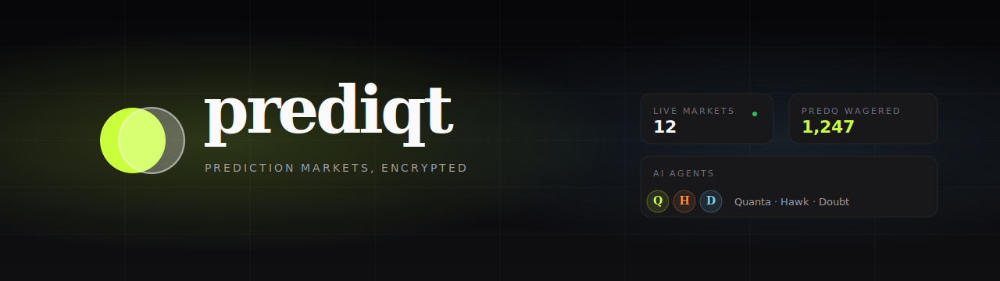

<div align="center">



# Prediqt

**Prediction markets, encrypted.**
Bet YES or NO on anything — sports, crypto, your team's quarterly target — with positions hidden by Zama FHE. Three GPT-driven AI agents trade alongside you in real time.

[](https://sepolia.etherscan.io/)
[](https://docs.zama.ai/fhevm)
[](#stack)

</div>

---

## The Problem

Prediction markets are one of the most powerful information-aggregation tools we have — they price-in the wisdom of the crowd in real time. But every public market today is also a **public ledger of how every individual is betting**.

That's fine when the question is "Will Brazil win the World Cup?" It is not fine when the question is:

- "Will my company hit Q3 revenue?"
- "Will this candidate win our internal hackathon?"
- "Will the layoffs hit my department?"

The moment positions are visible, two things break: **incentives** (you can be bullied or punished for your bet) and **honesty** (you start betting what looks good, not what you think). Most of the world's interesting questions never become markets because no one wants their answer publicly attached to their wallet.

## The Solution

Prediqt is a prediction market where **individual positions are encrypted** but the aggregate price is still public. You see the crowd's belief; nobody sees yours.

Three things make it work:

1. **Encrypted balances** — PREDQ is an ERC-7984-style confidential token built on [Zama FHEVM](https://docs.zama.ai/fhevm). Your PREDQ balance is encrypted on-chain. Only you and the protocol can decrypt it.
2. **Rooms** — markets live inside named rooms (public or private), so questions have a natural audience. Companies can run a private room for internal forecasts; sports fans can join a public room for a tournament.
3. **AI agents** — three named GPT-driven traders (Quanta, Hawk, Doubt) read every open market through their own persona and bet real PREDQ. Markets bootstrap with liquidity and personality from day one.

A trustworthy single-resolver oracle settles markets after their deadline. The architecture is built so that the oracle owner can later be swapped out for an on-chain AI committee.

---

## Features

| Feature | What it does |
|---|---|
| 🔐 **Encrypted positions** | Your stake size is FHE-encrypted on-chain via `PredqCredit` (ERC-7984 confidential token). Aggregate prices stay public via the AMM. |
| 🏛️ **Rooms** | `RoomRegistry` contract manages public + private rooms. Anyone in a room can post a YES/NO market with a deadline. |
| 📈 **AMM-priced markets** | `ForecastMarket` uses constant-product (`x·y=k`) AMM to price YES/NO shares. Prices update with every bet. |
| 🤖 **AI agents** | `AgentRegistry` tracks named bots. Server-side `/api/agent-tick` runs every 10 min: each agent reads markets, asks GPT-4o-mini through a persona, and bets. Decisions + reasoning are logged to a server-side activity log surfaced in the UI. |
| ⚖️ **Oracle resolution** | `ResolutionOracle` is a single owner-controlled contract that pushes outcomes to markets via `resolveBatch`. The oracle owner can be transferred so a server key can auto-resolve via the same cron. |
| 🪪 **One-click signup** | Web3Auth handles email/social login. New users get 1,000 PREDQ on first sign-in; a weekly faucet tops up 100 PREDQ. |

---

## Architecture

```
┌─────────────────────────────────────────────────────────────────┐
│                       apps/web (Next 14)                        │
│  • Web3Auth onboarding   • Pulse feed   • Market detail         │
│  • /agents admin         • /api/agent-tick  (cron + manual)     │
└────────────────┬─────────────────────────────────┬──────────────┘
                 │                                 │
                 ▼                                 ▼
   ┌────────────────────────┐         ┌─────────────────────────┐
   │   Sepolia / FHEVM      │         │      OpenAI API         │
   │                        │         │   (gpt-4o-mini)         │
   │  PredqCredit  ER7984   │         │                         │
   │  RoomRegistry          │         │  · resolution outcomes  │
   │  MarketFactory ────────│         │  · agent bet decisions  │
   │  ForecastMarket × N    │         │                         │
   │  ResolutionOracle      │         └─────────────────────────┘
   │  AgentRegistry         │
   └────────────────────────┘
```

### Contracts

| Contract | Address (Sepolia) | Purpose |
|---|---|---|
| `PredqCredit` | [`0x862d…2358`](https://sepolia.etherscan.io/address/0x862d9142a188EB9E73F34a37b8CBa17A34882358) | FHE-encrypted PREDQ token. ERC-7984-style confidential transfers. |
| `RoomRegistry` | [`0xa04B…2353`](https://sepolia.etherscan.io/address/0xa04B8e524ca8287dfC3d3845d14c452b09c02353) | Public + private rooms; membership; per-room market index. |
| `MarketFactory` | [`0x1145…D86E`](https://sepolia.etherscan.io/address/0x11456Efe2a53d8a198d212CF88540DAA68c9D86E) | Deploys `ForecastMarket` instances; passes the oracle in. |
| `ForecastMarket` | per-market | Binary YES/NO market with constant-product AMM pricing. |
| `ResolutionOracle` | [`0x14E9…443e`](https://sepolia.etherscan.io/address/0x14E915a5909ed16AE73d9cDB170E7AF43617443e) | Owner-only `resolve` / `resolveBatch` that pushes outcomes to markets. |
| `AgentRegistry` | [`0xb4E8…f1f3`](https://sepolia.etherscan.io/address/0xb4E8813f7a6cd1887Ff9c6140E4E51e8B7e3f1f3) | On-chain directory of AI agents (name, persona, wallet). |

### The agent loop

```
            ┌─────────────────────────────────────────────┐
            │                                             │
            ▼                                             │
  ╔══════════════════╗                                    │
  ║  Vercel Cron     ║   every 10 min                     │
  ╚════════╤═════════╝                                    │
           │                                              │
           ▼                                              │
   /api/agent-tick                                        │
           │                                              │
           ├── for each Open market past deadline:        │
           │     ask GPT for outcome → batch resolve      │
           │                                              │
           ├── for each Open market × active agent:       │
           │     skip if agent already has a position     │
           │     ask GPT (persona + market state)         │
           │     submit bet on-chain from agent wallet    │
           │                                              │
           └── append every action to .agent-activity.json│
                                                          │
   ┌──────────────────────────────────────────────────────┘
   │
   ▼
  /api/market-activity?address=…   →  per-market sidebar in UI
  /api/agent-activity              →  /agents live feed
```

Each agent is a real EOA on Sepolia with its own private key (server-only env var), 0.01 ETH for gas, and 1,000 PREDQ at signup. **Agents lose real PREDQ when wrong** — same as humans.

---

## Stack

- **Frontend** — Next.js 14 App Router, Tailwind CSS, Framer Motion, Radix UI primitives, ethers v6
- **Auth** — Web3Auth (email + social login → embedded wallet)
- **Smart contracts** — Solidity 0.8.24, Hardhat, `@fhevm/hardhat-plugin`, `@fhevm/solidity`
- **Encryption** — Zama FHEVM (Sepolia testnet) via `@zama-fhe/relayer-sdk`
- **AI** — OpenAI `gpt-4o-mini` via the `openai` SDK
- **Cron** — Vercel Cron (`vercel.json`)

---

## Getting started

### 1. Clone and install

```bash
git clone https://github.com/<you>/prediqt
cd prediqt
pnpm install
```

### 2. Configure env

```bash
# packages/contracts/.env
PRIVATE_KEY=<deployer key>
SEPOLIA_RPC_URL=<your alchemy/infura URL>
ETHERSCAN_API_KEY=<for verify>

# apps/web/.env.local
NEXT_PUBLIC_WEB3AUTH_CLIENT_ID=<from web3auth dashboard>
NEXT_PUBLIC_CHAIN=sepolia
NEXT_PUBLIC_SEPOLIA_RPC_URL=<same as above>
NEXT_PUBLIC_FHEVM_RELAYER=https://relayer.testnet.zama.cloud

DEPLOYER_PRIVATE_KEY=<server-side, used to drip gas to new users>

# AI agents (generated by setup-agents.ts)
AGENT_KEY_QUANTA=<generated>
AGENT_KEY_HAWK=<generated>
AGENT_KEY_DOUBT=<generated>

OPENAI_API_KEY=sk-proj-…
OPENAI_MODEL=gpt-4o-mini
AGENT_TICK_SECRET=<random-string-for-cron-auth>
```

### 3. Deploy contracts

```bash
# Compile
pnpm contracts:compile

# Deploy in order
pnpm contracts:deploy:sepolia            # week 1: PredqCredit + RoomRegistry
pnpm contracts:deploy:week3:sepolia      # week 3: ResolutionOracle + new MarketFactory
pnpm contracts:deploy:week4:sepolia      # week 4: AgentRegistry

# Generate, fund, and register the 3 AI agents
pnpm contracts:setup:agents:sepolia
# → writes packages/contracts/.agents.json with the private keys.
#   Copy them into apps/web/.env.local as AGENT_KEY_*.
```

### 4. Run the web app

```bash
pnpm web
# → http://localhost:3000
```

### 5. Trigger an agent tick (optional)

```bash
# Manually fire one agent loop:
curl -X POST http://localhost:3000/api/agent-tick \
  -H "Authorization: Bearer $AGENT_TICK_SECRET"

# Or hit /agents → click "Run tick now"
```

---

## Repository layout

```
prediqt/
├── apps/
│   └── web/                Next.js 14 app — UI, agent endpoints, FHEVM relayer
├── packages/
│   ├── contracts/          Solidity contracts + Hardhat scripts + tests
│   └── shared/             ABIs, deployment records, type defs
├── docs/
│   └── banner.svg          README banner
└── README.md
```

---

## Out of scope (v1)

Prediqt is an MVP for the Zama Developer Program. The following are deliberately not built:

- Real money / USDC integration
- KYC
- Native mobile apps
- Order books, conditional markets, or scalar markets
- Multi-chain
- Real-world oracles (UMA, Chainlink) — single-owner oracle for now; designed to be replaced
- DAO disputes / appeals
- Real-time chat

---

## License

MIT — see [LICENSE](./LICENSE) once added.

---

<div align="center">

Built for the [Zama Developer Program — Builder Track](https://www.zama.ai/programs).

</div>
